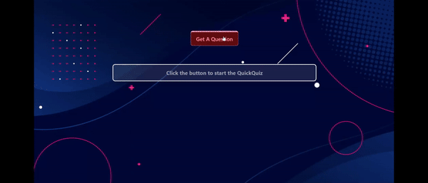

# Quick Quiz

Quick Quiz is a Single Page Application (SPA) that provides  quizzes using the the-trivia-api API. It is built with htmx for dynamic interactions, styled with Tailwind CSS for a modern and responsive design, and utilizes Nunjucks as the client-side template engine.

## Practice Project for htmx
This project serves as a practice ground for working with htmx, a library that allows for creating dynamic web applications with minimal JavaScript.

## Note:
This project uses CDN links for htmx, Tailwind CSS, and Nunjucks. There are no additional dependencies to install.

## Features

- **Quizzes:** Access a variety of tech-related quizzes sourced from the quizapi.io API.
- **Dynamic Updates:** Utilize htmx to enable seamless, dynamic updates without full-page reloads.
- **Responsive Design:** Enjoy a responsive and visually appealing user interface crafted with Tailwind CSS.
- **Client-side Templating:** Leverage Nunjucks for efficient and flexible client-side templating.

## Contributing
Contributions are welcome! If you find a bug or have an enhancement in mind, please open an issue or submit a pull request.

## Acknowledgments
[the-trivia-api](https://the-trivia-api.com) for providing the free API for quizzes.
[htmx](https://htmx.org/) for enabling seamless client-server communication.
[Tailwind](https://tailwindcss.com/) CSS for the responsive and utility-first styling.
[Nunjucks](https://mozilla.github.io/nunjucks/) for the client-side templating.

